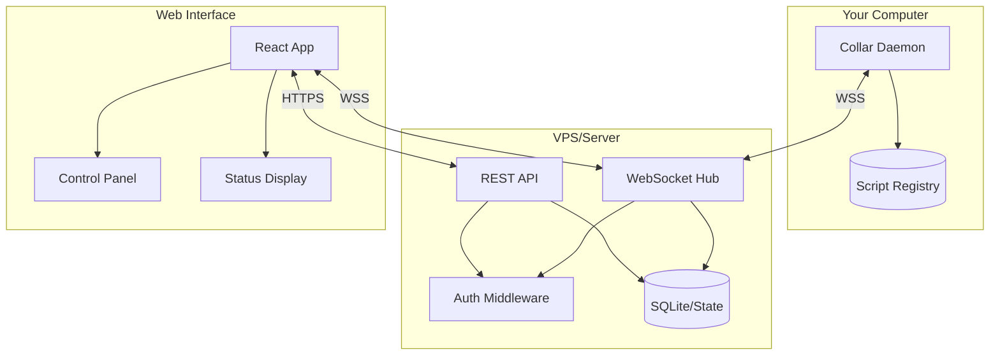
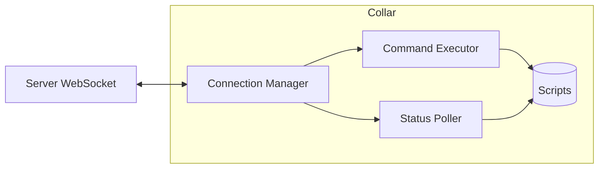
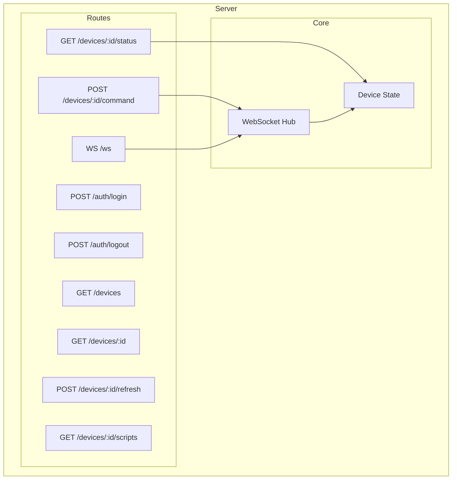
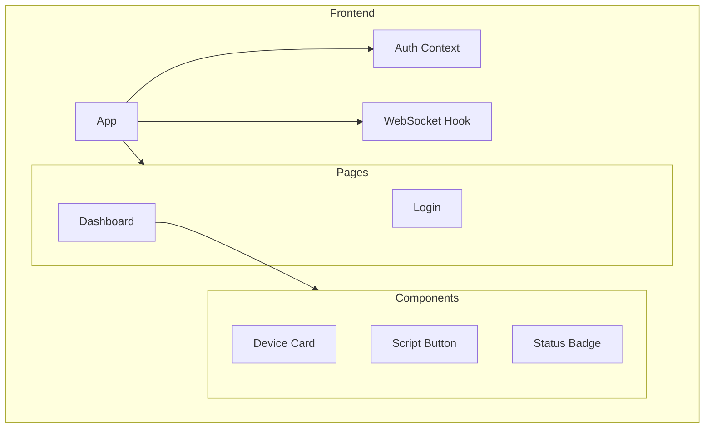
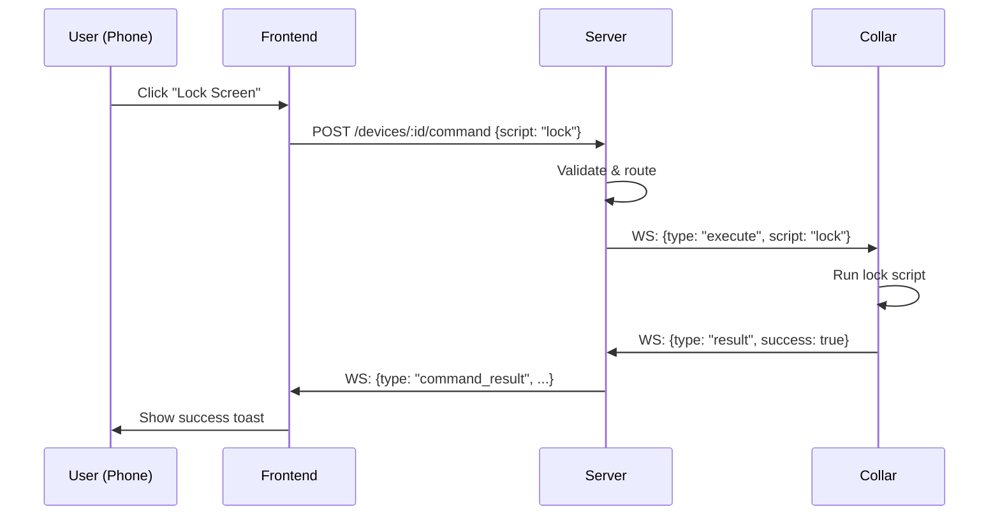
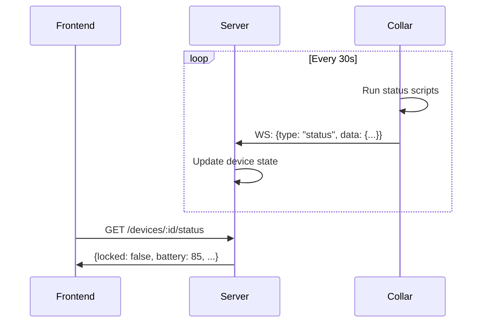
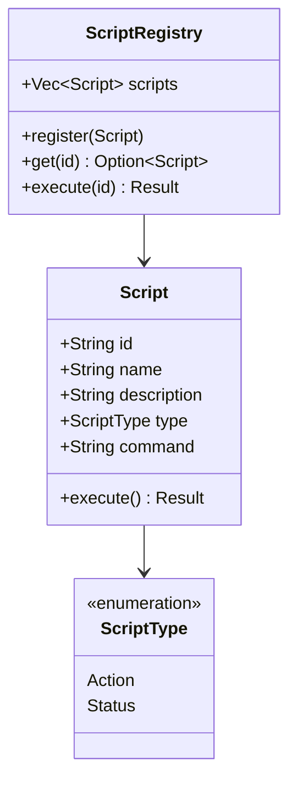
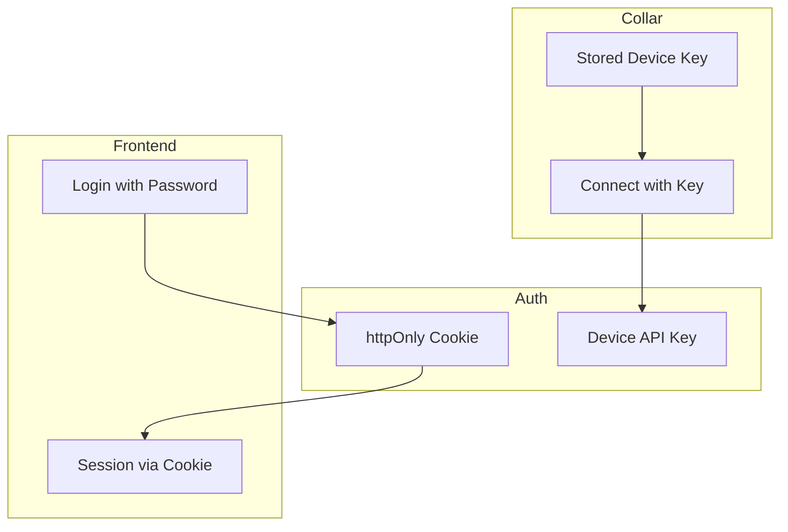

# Collar - Remote Control Architecture

## Overview

Collar is a three-component system for remotely controlling a computer from a phone or any web browser.

```
┌─────────────┐       ┌─────────────┐       ┌─────────────┐
│   Phone/    │ ◄───► │   Server    │ ◄───► │   Collar    │
│   Browser   │ HTTPS │   (API)     │  WSS  │   (Daemon)  │
└─────────────┘       └─────────────┘       └─────────────┘
    Frontend            VPS/Cloud           Your Computer
```

## System Architecture



## Component Details

### 1. Collar (Client Daemon)

The background service running on your computer.



**Responsibilities:**
- Maintain persistent WebSocket connection to server
- Execute registered scripts on command
- Poll system status periodically
- Auto-reconnect on disconnect

### 2. Server (API)

The intermediary that routes commands and maintains state.



**Responsibilities:**
- Authenticate users and devices
- Route commands from frontend to correct device
- Maintain device connection state
- Reject commands when target device is offline (no queueing — keeps retries predictable)

### 3. Frontend (React)

Clean control panel for sending commands and viewing status.



## Data Flow

### Command Execution Flow



### Status Polling Flow



## Script System

Scripts are the extensible unit of functionality.



### Script Configuration (TOML)

```toml
[[scripts]]
id = "lock"
name = "Lock Screen"
description = "Lock the desktop session"
type = "action"
command = "loginctl lock-session"

[[scripts]]
id = "unlock"
name = "Unlock Screen"
description = "Unlock the desktop session"
type = "action"
command = "loginctl unlock-session"

[[scripts]]
id = "is_locked"
name = "Lock Status"
description = "Check if screen is locked"
type = "status"
command = "loginctl show-session -p LockedHint --value"
```

## Security Model



**Security Measures:**
- JWT authentication via httpOnly cookies (XSS-resistant)
- Rate limiting (100 requests/minute per IP)
- Device-specific API keys for daemons
- Scripts defined locally on daemon (server cannot send arbitrary commands)

## Project Structure

```
collar/
├── collar-daemon/          # Rust - Background service
│   ├── src/
│   │   ├── main.rs
│   │   ├── config.rs       # Configuration
│   │   ├── connection.rs   # WebSocket client
│   │   ├── executor.rs     # Script execution
│   │   └── scripts.rs      # Script registry
│   └── Cargo.toml
│
├── collar-server/          # Rust - API server
│   ├── src/
│   │   ├── main.rs
│   │   ├── api.rs          # REST endpoints
│   │   ├── auth.rs         # JWT + cookie authentication
│   │   ├── config.rs       # Configuration
│   │   ├── ratelimit.rs    # Rate limiting middleware
│   │   ├── state.rs        # Shared app state
│   │   └── ws.rs           # WebSocket handler
│   └── Cargo.toml
│
├── collar-web/             # React - Frontend
│   ├── src/
│   │   ├── App.tsx
│   │   ├── main.tsx
│   │   ├── api.ts          # API client
│   │   ├── types.ts        # TypeScript types
│   │   ├── styles.css
│   │   ├── pages/
│   │   ├── components/
│   │   └── hooks/
│   └── package.json
│
├── collar-common/          # Shared Rust types
│   ├── src/
│   │   └── lib.rs
│   └── Cargo.toml
│
├── deploy/                 # Deployment configs
│   ├── nginx/
│   │   └── collar.conf
│   ├── collar-daemon.service
│   ├── collar-server.service
│   └── install-daemon.sh
│
├── collar.example.toml     # Daemon config example
├── server.example.toml     # Server config example
└── docs/
    └── ARCHITECTURE.md
```

## Technology Choices

| Component | Technology | Rationale |
|-----------|------------|-----------|
| Daemon | Rust + tokio | Reliable, low resource usage |
| Server | Rust + axum | Fast, type-safe, async |
| Frontend | React + TypeScript | Clean, maintainable UI |
| WebSocket | tokio-tungstenite | Native async Rust |
| Auth | JWT | Stateless, secure |
| Config | TOML | Human-readable, Rust-native |
